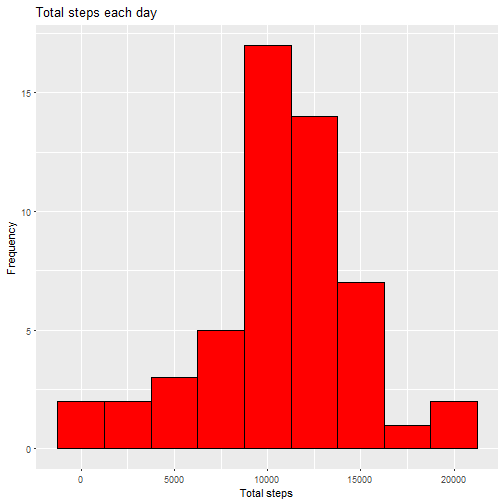
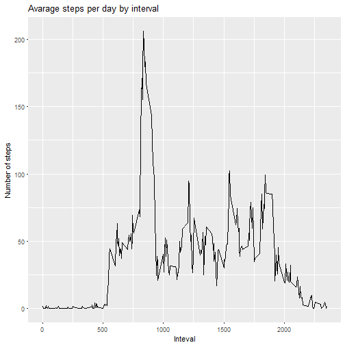
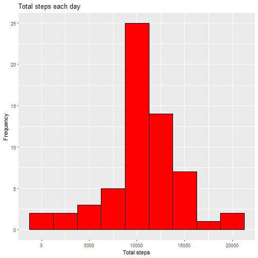
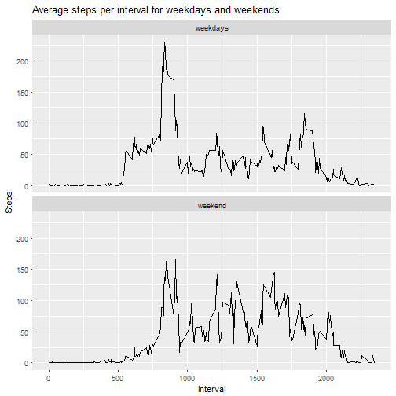

# Course Project 1
Author; Martijn Bonnema

## First we have to load the data and convert the data to an as.Date


```r
my.data <- read.csv("activity.csv", header = T, sep = ",", na.strings = "NA")


my.data$date <- as.Date(my.data$date, format = "%Y-%m-%d")


head(my.data)
```

```
##   steps       date interval
## 1    NA 2012-10-01        0
## 2    NA 2012-10-01        5
## 3    NA 2012-10-01       10
## 4    NA 2012-10-01       15
## 5    NA 2012-10-01       20
## 6    NA 2012-10-01       25
```

I also used the following packages


```r
library(tidyverse)
```


## 2. Histogram of the total number of steps taken each day


```r
totalsteps <- aggregate(steps ~ date, data = my.data, FUN = sum)

ggplot(data = totalsteps)+
  geom_histogram(mapping = aes(x = steps), binwidth = 2500, color = "black", fill = "red")+
  labs(title = "Total steps each day", x = "Total steps", y = "Frequency")
```




## 3. Mean and median number of steps taken each day


```r
meansteps <- mean(totalsteps$steps)


mediansteps <- median(totalsteps$steps)
```
The mean of number steps is 1.0766189 &times; 10<sup>4</sup> and the median is 10765


## 4. Time series plot of the average number of steps taken per interval


```r
meansteps <- aggregate(steps ~ interval, data = my.data, FUN = mean)

ggplot(data = meansteps)+
  geom_line(mapping = aes(x = interval, y = steps))+
  labs(title = "Avarage steps per day by interval", x = "Inteval", y = "Number of steps")
```




## 5. The 5-minute interval that, on average, contains the maximum number of steps


```r
maximumaverage <- meansteps[which.max(meansteps$steps),]$interval
```

The 5-minute with the maximum number of steps is interval 835

## 6. Code to describe and show a strategy for imputing missing data

I'will use the average number of steps per interval as the new values for the missing values.

But first I'will show the number of missing values:


```r
sum(is.na(my.data$steps))
```

```
## [1] 2304
```

For the missing values I'will impute the mean of number of steps per interval, so if a value on interval 540 is missing it is replaced with the avrage of steps for interval 540.


```r
missingvalues <- my.data

missingvalues <- transform(missingvalues, steps = ifelse(is.na(steps), ave(steps, interval, FUN = function(x) mean(x, na.rm = T)), steps))
head(missingvalues)
```

```
##       steps       date interval
## 1 1.7169811 2012-10-01        0
## 2 0.3396226 2012-10-01        5
## 3 0.1320755 2012-10-01       10
## 4 0.1509434 2012-10-01       15
## 5 0.0754717 2012-10-01       20
## 6 2.0943396 2012-10-01       25
```

## 7. Histogram of the total number of steps taken each day after missing values are imputed


```r
totalsteps2 <- aggregate(steps ~ date, data = missingvalues, FUN = sum)

ggplot(data = totalsteps2)+
  geom_histogram(mapping = aes(x = steps),binwidth = 2500, color = "black", fill = "red")+
  labs(title = "Total steps each day", x = "Total steps", y = "Frequency")
```



```r
meansteps2 <- mean(totalsteps2$steps)

mediansteps2 <- median(totalsteps2$steps)


mediandiff <- mediansteps2 - mediansteps

totaldiff <- sum(totalsteps2$steps) - sum(totalsteps$steps)
```

The mean 1.0766189 &times; 10<sup>4</sup> is the same as before because we used the mean of the intervals to impute missing values and the new median is 1.0766189 &times; 10<sup>4</sup> steps.

The difference in median is 1.1886792 steps

The difference in total number of steps is 8.6129509 &times; 10<sup>4</sup> 

## Panel plot comparing the average number of steps taken per 5-minute interval across weekdays and weekends

first we have to make a difference between weekdays and weekends.
Now we can make an aggregate and plot two graphs with ggplot2 package


```r
missingvalues$days <- weekdays(missingvalues$date, abbreviate = F)

weekdays <- c("maandag", "dinsdag", "woensdag", "donderdag", "vrijdag")

missingvalues$dag <- as.factor(ifelse(missingvalues$days %in% weekdays, "weekdays", "weekend"))

aggregate <- aggregate(steps ~ interval+dag, data = missingvalues, FUN = mean)

ggplot(data = aggregate)+
  geom_line(mapping = aes(x = interval, y = steps))+
  facet_wrap(~dag, nrow = 2)+
  labs(title = "Average steps per interval for weekdays and weekends", x = "Interval" , y= "Steps")
```



